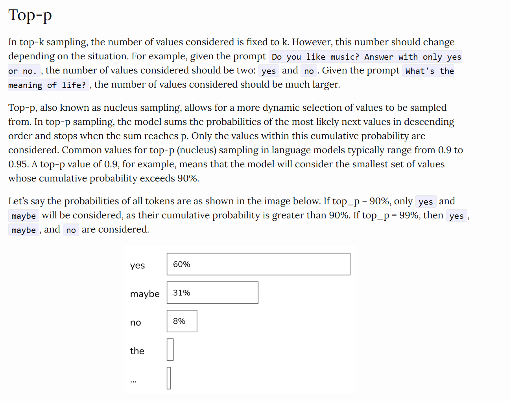

# Prompting Fundamentals — the anatomy of a prompt

## Goal
Internalize that **prompt = instruction + demonstrations + input/output format**. This decomposition is exactly what every optimizer later tunes, so name the parts explicitly here.

## Resources
- Start from here. Must read: https://lilianweng.github.io/posts/2023-03-15-prompt-engineering/
    - Lengthy and not all parts are always relevant. Read till: Automatic Prompt Design
- Anthropic prompt engineering guide (chain-of-thought, examples, output formatting pages) — https://docs.claude.com/en/docs/build-with-claude/prompt-engineering/overview
- Chip Huyen's blog for generation configurations: https://huyenchip.com/2024/01/16/sampling.html
    - a more in-depth guide on *why* AI responses are probabilistic + important terms like test time compute.

## Task
Classify customer support tickets into 3 categories: **billing**, **technical**, **general**.

## What I built
- **`prompts/zero_shot.txt`** — zero-shot variant (instruction only, no examples)
- **`prompts/few_shot.txt`** — few-shot variant (instruction + 3 examples)
- **`prompts/few_shot_cot.txt`** — few-shot + chain-of-thought (model reasons before answering)
- **`prompt_practice.py`** — runs all three variants against `prompts/train_tickets.txt` and reports accuracy
- Picked the best-performing prompt, ran it on `prompts/test_tickets.txt`, then tuned it further
- **`friction_log.md`** — what was annoying about tuning prompts by hand (no objective comparison, results felt arbitrary). This is the written motivation for the rest of the repo.

## Takeaway
Every prompt here decomposes cleanly into instruction + demonstrations + format — I can point at any one and name which part is doing what, and why.

## Extension: confidence visualizer
Built on Chip Huyen's bar-chart concept for visualizing model confidence: a Streamlit app (`challenge/confidence_visualizer_mcq.py`) that takes a multiple-choice question and renders each answer's probability as a bar chart, pulled from the API's logprobs. A second version (`challenge/confidence_visualizer_judge.py`) extends this to accept custom judge criteria as a system prompt instead of a fixed one.

Full write-up, including the token-level parsing issues and bias observations: `challenge/challenge.md`.

