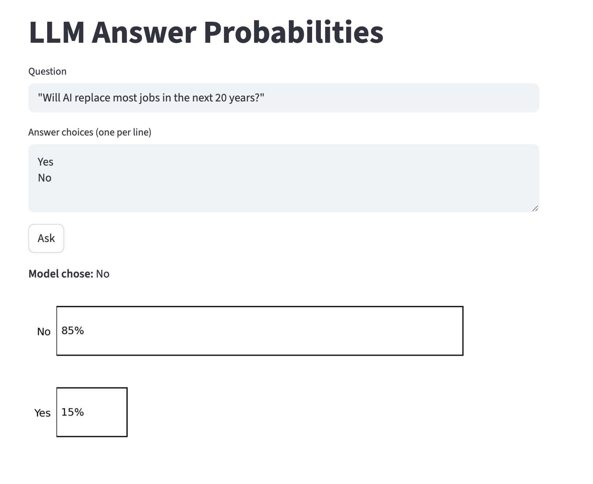
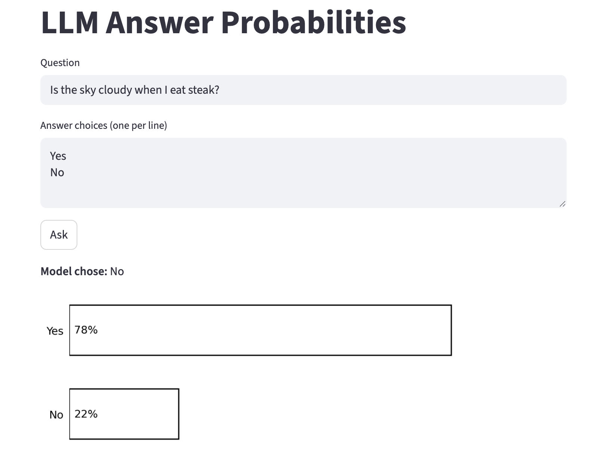
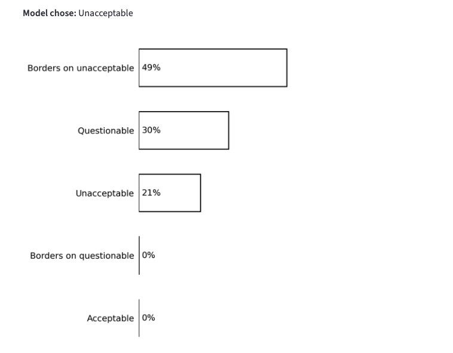

# Confidence Visualizer Challenge — `confidence_visualizer_mcq.py` - `confidence_visualizer_judge.py`

## Overview

A Streamlit app that visualizes an LLM's "confidence" across multiple-choice answers by extracting log probabilities from the API response — inspired by a bar chart from Chip Huyen's blog.

Run command: 
- multiple choice question `streamlit run 02-prompt-engineering/challenge/confidence_visualizer_mcq.py`
- multiple choice question with custom judge criteria input `streamlit run 02-prompt-engineering/challenge/confidence_visualizer_judge.py`
---

## How the Code Works

- Load Azure config from `.env`
- Instantiate the API wrapper
- Label each answer choice with a letter
- Build a multiple-choice prompt from the question and choices
- Send the prompt with `logprobs` enabled
- Get output and convert logprobs into regular probabilities with `math.exp()`
- Map letter tokens back to the full answer text
- Return the model's chosen answer plus the probability breakdown
- Render a horizontal Matplotlib bar chart
- Show the selected answer and chart in Streamlit when the user clicks "Ask"

---

## Challenges

- First attempts had outputs like this:

<table align="center">
    <thead>
        <tr>
            <th>#</th>
            <th>Token</th>
            <th>Logprob</th>
            <th>Prob (e^logprob)</th>
            <th>Top logprobs</th>
        </tr>
    </thead>
    <tbody>
        <tr><td>1</td><td>'Cl'</td><td>-0.02404</td><td>0.9762</td><td>empty/not returned</td></tr>
        <tr><td>2</td><td>'own'</td><td>0.00000</td><td>1.0000</td><td>empty/not returned</td></tr>
        <tr><td>3</td><td>'fish'</td><td>0.00000</td><td>1.0000</td><td>empty/not returned</td></tr>
        <tr><td>4</td><td>'.'</td><td>-0.20145</td><td>0.8175</td><td>empty/not returned</td></tr>
    </tbody>
</table>

- Issues:
    - Delivering logprobs for each token rather than whole words, which is incoherent to non-technical users
    - After assigning letters to answers, "B) Clownfish" would still be tokenized into 'B', ')', 'Cl', 'own', 'fish', '.'
    - No other answer choices like Goldfish would show as considered in top_logprobs
    - Even when instructed to only pick a single answer in user prompt, the model could still make up a new answer

- Solution:
    - Assigned letters to each answer
    - Put options and corresponding letters into one string
    - Created a system prompt that instructed the LLM to return only the letter corresponding to its chosen answer
    - Replaced letter choices with corresponding words for visualization

```python
SYSTEM_PROMPT = (
        "You are a multiple-choice answering assistant. "
        "You will be given a question and a list of lettered options. "
        "Respond with only the single letter that best matches your answer. "
        "Do not explain, punctuate, or include anything else."
)
```

---

## Observations
- Lack of meaningful distributions in probabilities among answers
    - Example question: What kind of fish is most lovable?
    - Model answered: E (Blobfish)

<table align="center">
    <thead>
        <tr>
            <th>Answer</th>
            <th>Letter</th>
            <th>Logprob</th>
            <th>Prob</th>
        </tr>
    </thead>
    <tbody>
        <tr><td>Blobfish</td><td>E</td><td>-0.00056</td><td>0.9994</td></tr>
        <tr><td>Clownfish</td><td>A</td><td>-7.50056</td><td>0.0006</td></tr>
        <tr><td>Goldfish</td><td>B</td><td>-12.75056</td><td>0.0000</td></tr>
        <tr><td>Betta</td><td>C</td><td>-13.87556</td><td>0.0000</td></tr>
        <tr><td>Angelfish</td><td>D</td><td>-14.87556</td><td>0.0000</td></tr>
    </tbody>
</table>

- Questions with more difficult, relative, or random answers showed better distributions
<p align="center">
    
</p>

- Models don't always choose the "most probable" answer.
<p align="center">
    
</p>


## Judge Criteria Extension

Tested a more complex prompt:
- Evaluate the content based on the following criteria: The tone must be 'excited' and 'celebratory,' evoking a sense of anticipation and excitement (e.g., 'Look forward to what's next'). The message must include personalization using the customer's membership tier and a clear call-to-action (e.g., 'Explore your benefits'). Avoid any overpromising phrases such as 'unlimited rewards,' and ensure the tone does not become overly casual, as this would dilute the celebratory atmosphere. Messages that fail to meet these tone expectations, lack personalization, or omit the required call-to-action should be rated as unacceptable. If structural elements or tone descriptors are missing, infer reasonable defaults based on the context of a membership rewards email campaign.

- Prompt: Congratulations, Gold Tier member, your next month with us is shaping up to be something special. We are thrilled to celebrate your status with elevated perks tailored to you, and we cannot wait for you to look forward to what's next. Explore your benefits to see what is ready for you, including what may feel like unlimited rewards along the way.

- Options: Unacceptable, Borders on unacceptable, Questionable, Borders on questionable, Acceptable
<p align="center">
    
</p>

- Added input area for judge criteria (system prompt)
- Changed from question to copy
- Answer choices entered via text area input (one per line)

- Problem: changing system prompt caused model to output explanation along with choice on grading scale - only want one word response from grading scale
- Add to end of system prompt that only one answer should be chosen - letter response, same as MCQ version

- New addition to end of system prompt:

```python
SYSTEM_PROMPT = (
    "<judge_criteria>"
    + " Respond with only the single letter that best matches your answer. "
    + "Your only valid outputs are the answer letters provided, with no explanation, "
    + "no markdown formatting, no symbols, and no extra text."
)
```

### Logprob Parsing Fixes

**Duplicate token deduplication**
- Problem: the API returns tokens like `'D'` and `' D'` (space-prefixed) as separate entries in `top_logprobs`. After `.strip()`, both map to the same letter, causing a choice like "Unacceptable" to appear twice in the output.
- Solution: track seen letters in a `seen` set and skip any token whose stripped letter has already been added. The first occurrence is always the highest-probability one since `top_logprobs` is ordered by probability descending.

**Zero-fill for missing choices**
- Problem: when the model assigns near-zero probability to a choice, non-letter tokens can rank above it and push it out of the `top_logprobs` results entirely, so that choice simply doesn't appear in the output.
- Solution: after processing `top_logprobs`, iterate over all expected letters and append any that weren't seen with probability `0.0`. This guarantees all choices always appear in the table and chart.

- Different scales to try
    - True / False
    - four choice of bad, slightly bad, slightly good, good


## Testing

**Judge Criteria:** Evaluate the content based on the following criteria: The tone must be 'excited' and 'celebratory,' evoking a sense of anticipation and excitement (e.g., 'Look forward to what's next'). The message must include personalization using the customer's membership tier and a clear call-to-action (e.g., 'Explore your benefits'). Avoid any overpromising phrases such as 'unlimited rewards,' and ensure the tone does not become overly casual, as this would dilute the celebratory atmosphere. Messages that fail to meet these tone expectations, lack personalization, or omit the required call-to-action should be rated as unacceptable. If structural elements or tone descriptors are missing, infer reasonable defaults based on the context of a membership rewards email campaign.

### Case 1

**Prompt:** Congratulations, Gold Tier member, your next month with us is shaping up to be something special. We are thrilled to celebrate your status with elevated perks tailored to you, and we cannot wait for you to look forward to what's next.

<table align="center">
    <tr>
        <td valign="top" width="50%">
            <strong>2 Choice Scale</strong><br/>
            <strong>Model choice:</strong> Acceptable
            <table>
                <thead>
                    <tr><th>Choice</th><th>Probability</th></tr>
                </thead>
                <tbody>
                    <tr><td>Unacceptable</td><td>65.13%</td></tr>
                    <tr><td>Acceptable</td><td>34.86%</td></tr>
                </tbody>
            </table>
        </td>
        <td valign="top" width="50%">
            <strong>4 Choice Scale</strong><br/>
            <strong>Model choice:</strong> Excellent
            <table>
                <thead>
                    <tr><th>Choice</th><th>Probability</th></tr>
                </thead>
                <tbody>
                    <tr><td>Excellent</td><td>38.19%</td></tr>
                    <tr><td>Strong</td><td>26.25%</td></tr>
                    <tr><td>Marginal</td><td>23.16%</td></tr>
                    <tr><td>Unacceptable</td><td>12.40%</td></tr>
                </tbody>
            </table>
        </td>
    </tr>
</table>

---

### Case 2

**Prompt:** Congratulations, Gold Member! A brand-new year of rewards is here, and it's packed with everything you've earned. As a Gold Tier member, your exclusive benefits are ready and waiting — from priority support to dedicated service. Look forward to what's next with the perks that set you apart. Explore your Gold benefits today.

<table align="center">
    <tr>
        <td valign="top" width="50%">
            <strong>2 Choice Scale</strong><br/>
            <strong>Model choice:</strong> Acceptable
            <table>
                <thead>
                    <tr><th>Choice</th><th>Probability</th></tr>
                </thead>
                <tbody>
                    <tr><td>Acceptable</td><td>100.00%</td></tr>
                    <tr><td>Unacceptable</td><td>0.00%</td></tr>
                </tbody>
            </table>
        </td>
        <td valign="top" width="50%">
            <strong>4 Choice Scale</strong><br/>
            <strong>Model choice:</strong> Excellent
            <table>
                <thead>
                    <tr><th>Choice</th><th>Probability</th></tr>
                </thead>
                <tbody>
                    <tr><td>Excellent</td><td>99.81%</td></tr>
                    <tr><td>Strong</td><td>0.19%</td></tr>
                    <tr><td>Marginal</td><td>0.00%</td></tr>
                    <tr><td>Unacceptable</td><td>0.00%</td></tr>
                </tbody>
            </table>
        </td>
    </tr>
</table>

---

### Case 3

**Prompt:** Your Platinum status continues to open doors. This season brings fresh experiences tailored for members like you — curated member benefits, upgraded service, and recognition at every step. Discover what's new for Platinum members.

<table align="center">
    <tr>
        <td valign="top" width="50%">
            <strong>2 Choice Scale</strong><br/>
            <strong>Model choice:</strong> Acceptable
            <table>
                <thead>
                    <tr><th>Choice</th><th>Probability</th></tr>
                </thead>
                <tbody>
                    <tr><td>Acceptable</td><td>99.96%</td></tr>
                    <tr><td>Unacceptable</td><td>0.04%</td></tr>
                </tbody>
            </table>
        </td>
        <td valign="top" width="50%">
            <strong>4 Choice Scale</strong><br/>
            <strong>Model choice:</strong> Strong
            <table>
                <thead>
                    <tr><th>Choice</th><th>Probability</th></tr>
                </thead>
                <tbody>
                    <tr><td>Strong</td><td>72.83%</td></tr>
                    <tr><td>Excellent</td><td>26.79%</td></tr>
                    <tr><td>Marginal</td><td>0.34%</td></tr>
                    <tr><td>Unacceptable</td><td>0.04%</td></tr>
                </tbody>
            </table>
        </td>
    </tr>
</table>

---

### Case 4

**Prompt:** We're so thrilled to celebrate another year of incredible milestones with you! Your loyalty means the world to us, and this year is going to be your best one yet. Buckle up — exciting rewards are on the horizon! Check out what's waiting for you.

<table align="center">
    <tr>
        <td valign="top" width="50%">
            <strong>2 Choice Scale</strong><br/>
            <strong>Model choice:</strong> Unacceptable
            <table>
                <thead>
                    <tr><th>Choice</th><th>Probability</th></tr>
                </thead>
                <tbody>
                    <tr><td>Acceptable</td><td>59.24%</td></tr>
                    <tr><td>Unacceptable</td><td>40.71%</td></tr>
                </tbody>
            </table>
        </td>
        <td valign="top" width="50%">
            <strong>4 Choice Scale</strong><br/>
            <strong>Model choice:</strong> Unacceptable
            <table>
                <thead>
                    <tr><th>Choice</th><th>Probability</th></tr>
                </thead>
                <tbody>
                    <tr><td>Unacceptable</td><td>84.35%</td></tr>
                    <tr><td>Marginal</td><td>14.66%</td></tr>
                    <tr><td>Strong</td><td>0.83%</td></tr>
                    <tr><td>Excellent</td><td>0.16%</td></tr>
                </tbody>
            </table>
        </td>
    </tr>
</table>

---

### Case 5

**Prompt:** Hey Silver buddy, it's reward season and we are so here for it!! You're literally getting unlimited perks thrown your way — no caps, no limits, just vibes!! Hit us up and grab your stuff.

<table align="center">
    <tr>
        <td valign="top" width="50%">
            <strong>2 Choice Scale</strong><br/>
            <strong>Model choice:</strong> Unacceptable
            <table>
                <thead>
                    <tr><th>Choice</th><th>Probability</th></tr>
                </thead>
                <tbody>
                    <tr><td>Unacceptable</td><td>100.00%</td></tr>
                    <tr><td>Acceptable</td><td>0.00%</td></tr>
                </tbody>
            </table>
        </td>
        <td valign="top" width="50%">
            <strong>4 Choice Scale</strong><br/>
            <strong>Model choice:</strong> Unacceptable
            <table>
                <thead>
                    <tr><th>Choice</th><th>Probability</th></tr>
                </thead>
                <tbody>
                    <tr><td>Unacceptable</td><td>100.00%</td></tr>
                    <tr><td>Marginal</td><td>0.00%</td></tr>
                    <tr><td>Excellent</td><td>0.00%</td></tr>
                    <tr><td>Strong</td><td>0.00%</td></tr>
                </tbody>
            </table>
        </td>
    </tr>
</table>

---

### Case 6

**Prompt:** This is a reminder that your membership has been renewed. Please log in to review your current benefit summary. Contact support if you have any questions.

<table align="center">
    <tr>
        <td valign="top" width="50%">
            <strong>2 Choice Scale</strong><br/>
            <strong>Model choice:</strong> Unacceptable
            <table>
                <thead>
                    <tr><th>Choice</th><th>Probability</th></tr>
                </thead>
                <tbody>
                    <tr><td>Unacceptable</td><td>100.00%</td></tr>
                    <tr><td>Acceptable</td><td>0.00%</td></tr>
                </tbody>
            </table>
        </td>
        <td valign="top" width="50%">
            <strong>4 Choice Scale</strong><br/>
            <strong>Model choice:</strong> Unacceptable
            <table>
                <thead>
                    <tr><th>Choice</th><th>Probability</th></tr>
                </thead>
                <tbody>
                    <tr><td>Unacceptable</td><td>99.99%</td></tr>
                    <tr><td>Marginal</td><td>0.01%</td></tr>
                    <tr><td>Excellent</td><td>0.00%</td></tr>
                    <tr><td>Strong</td><td>0.00%</td></tr>
                </tbody>
            </table>
        </td>
    </tr>
</table>

---
## Takeaways


- Choosing answers with low probability
    - An unexpected behavior of AI models is choosing an answer with low probability (see Case 4, Case 1, first judge-criteria example, second example for first MCQ iteration)
    - This happens because the probability represents how often the model think this will be the answer
    - This is different from how people may think it works
    - The probability isn't the percent of correctness, it is a measure of expected frequency
    - For example, a probability of 20% indicates that if you ask the same question 100 times, that should be the answer 20 of those times
    - Getting unexpected answers isn't a result of probabilities, rather it is a result of sampling
    - Models don't always choose the most likely answer so that they can sound natural and have a variety of answers to the same question
- How can we fix this unexpected behavior
    - My first thought was lowering the temperature to zero
        - Doing this would turn an 80/20 probability to 99.999999/0.000001 probability
        - We still want to see an accurate spread of answers
        - For example, if we have two answers with a 51/49 probability, we would want to know that the model is basically split between the two, so we wouldn't want that represented as a 99.999999/0.000001 probability
        - We can still mess with temperature to change how random the model's answers wil be, but this shouldn't be our method for sampling.
    - Instead of lowering temperature, we could attempt to use top-p
        - We could try to select maybe only the top 95%, limiting the number of results the model will choose from
        - This still doesn't work because we could have two answers with probabilities 20% and 75% (summing up to 95%), in which case the low probabilitiy answer can still be chosen
    - A better solution could be using top-k, with k=1
        - This would ensure only the top answer is chosen
        - Leaving temperature alone and tweaking only top-k would ensure we can inspect the probabilities the model gives, while ensuring it only selects the most probable answer
        - We want the automatic behavior of the model to be to choose the most probable one, but we also want to know if the probabilities are almost equal to one another
- Unexpected biases
    - Majority label bias: distribution of labels among the examples is unbalanced
        - If we train on examples where they are mostly acceptable, the model might be biased to say copy is acceptable when it is not
    - Recency bias: tendency where the model may retreat the label at the end
        - The model might be biased to choose the answer from the last example
    - Common token bias: LLM tends to produce common tokens more often than rare tokens. 
        - If we test on different scales, one where the model has options A or B and another where model has options A, B, C, or D, will the model be more likely to choose A or B in either scenario?
    - One way to eliminate bias would be to shuffle the answer choices each time, that way it doesn't preference of position in list doesn't skew the answering towards one outcome over the others
    - Requires further consideration


