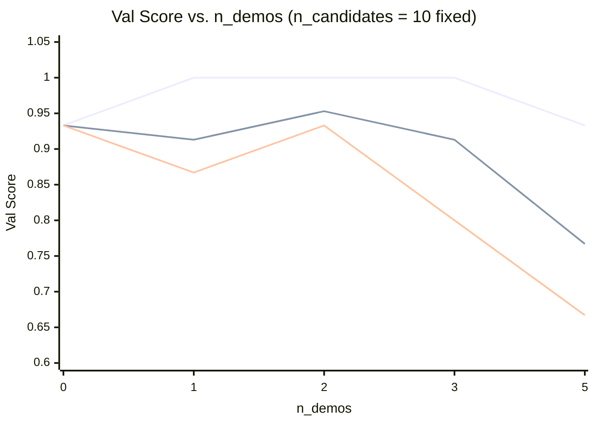
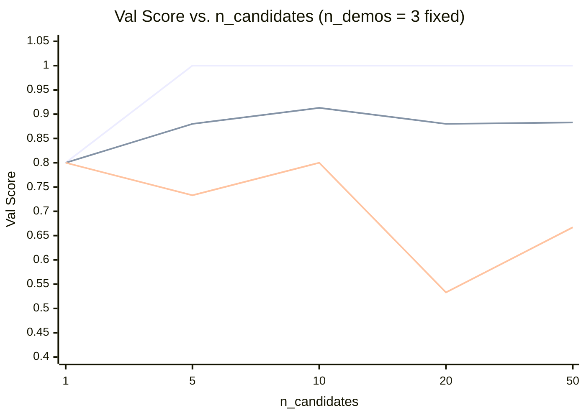

# Ablation Note

Run `optimizer_v1.py` with different settings and fill in the tables below.
This is how you understand the cost/benefit of searching more — and it's the
kind of analysis you'll repeat for every optimizer you build.

## Ablation 1: Val score vs. number of demos

Fix `n_candidates=10`, vary `n_demos`.

| n_demos | Best val score | Min | Max | Mean |
|---------|----------------|-----|-----|------|
| 0 (zero-shot baseline) | 0.933 | — | — | — |
| 1 | 1.000 | 0.867 | 1.000 | 0.913 |
| 2 | 1.000 | 0.933 | 1.000 | 0.953 |
| 3 | 1.000 | 0.800 | 1.000 | 0.913 |
| 5 | 0.933 | 0.667 | 0.933 | 0.767 |

*Lines from top to bottom: Max, Mean, Min. Zero-shot baseline (n=0): best val = 0.933, no variance data.*

Performance peaked with 2 demos when judged by the mean. Max plateau occurs at 1 demo and declines at 5.

## Ablation 2: Val score vs. number of candidates

Fix `n_demos=3`, vary `n_candidates`.

| n_candidates | Best val score | Min | Max | Mean | LLM calls | Wall-clock time (approx.) |
|--------------|----------------|-----|-----|------|-----------|---------------------------|
| 1 | 0.800 | 0.800 | 0.800 | 0.800 | 15 | ~30s |
| 5 | 1.000 | 0.733 | 1.000 | 0.880 | 75 | ~2.5 min |
| 10 | 1.000 | 0.800 | 1.000 | 0.913 | 150 | ~5 min |
| 20 | 1.000 | 0.533 | 1.000 | 0.880 | 300 | ~10 min |
| 50 | 1.000 | 0.667 | 1.000 | 0.883 | 750 | ~25 min |

*Lines from top to bottom: Max, Mean, Min.*

**One-sentence takeaway:**
Performance peaked with 10 candidates when judged by the mean. Max plateau occurs at 5 candidates.

## Overall conclusion

More candidates and demos doesn't equate to better performance. There is a balance between more context and tests that offers peak performance and median cost. I think 2 demos and 10 candidates would yield the highest performance for this task without requiring high expense. For a more complicated task, the number of tests and context would presumably be higher, as would the cost.
