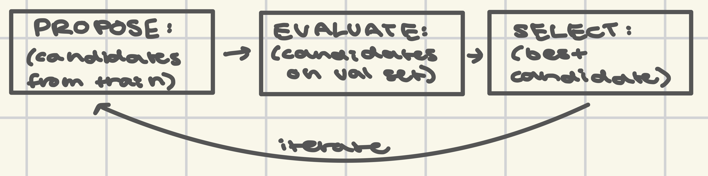

# Optimizer Loop Diagram — v1

The PROPOSE → EVALUATE → SELECT loop, drawn from memory, on paper, without notes open.

## The three boxes

```
┌──────────────┐       ┌───────────────┐       ┌────────────┐
│   PROPOSE    │──────▶│   EVALUATE    │──────▶│   SELECT   │
│              │       │               │       │            │
│ Generate N   │       │ Score each    │       │ Keep the   │
│ candidates   │       │ candidate on  │       │ best-      │
│ (instruction │       │ the VAL set   │       │ scoring    │
│ + demo       │       │ using eval.py │       │ candidate  │
│ subsets)     │       │               │       │            │
└──────────────┘       └───────────────┘       └────────────┘
       ▲                                               │
       │               (optional: iterate)             │
       └───────────────────────────────────────────────
```

## Diagram

<p align="center">
    
</p>

## Questions this answers
- What is a "candidate"? (instruction + demo subset)
- Why does EVALUATE use the **val** set, not train?
- Why does SELECT pick the *highest*-scoring candidate and not the average?
- What happens to the rejected candidates?
